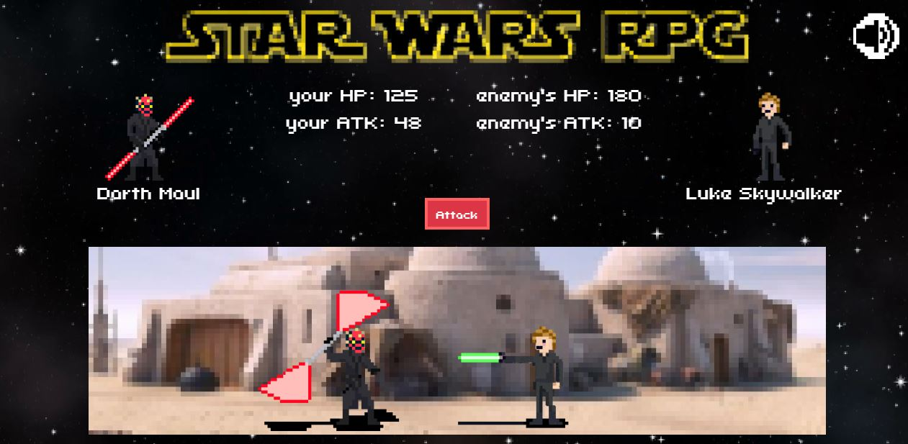
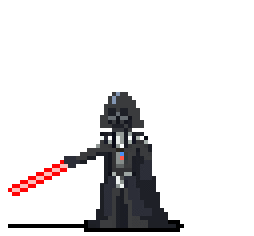

# Star Wars RPG 

### Overview
This project is a game in which the user pick a Star-Wars characters and fight other characters.

### How does it work?
The game gives the user a choice to pick the Sith or the Jedi order. Choosing a side will give the user a choice between four players.
The user picks a character and will have to fight the four other characters from the side he didn't choose (Sith or Jedi). Picking the right order is important since only one sequence will lead to victory.
After choosing an opponent, the user will attack the enemy until one will prevail.

### Why does useful?
This is a great example of using Jquery to do actions like adding classes, hiding, changing attributes and more - through javascript.

### How do the user play?
Instructions are showing in the html page. This game is looped - so there are no wrong buttons to push.

